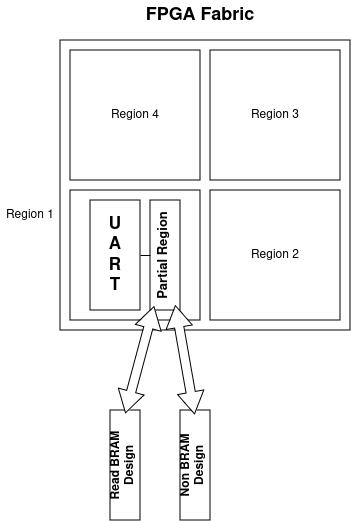

# Documentation on FPGA BRAMs for PUFs

## General

- BRAMs can have an initial value different from 0 after being switched on.  
- Initial values can potentially used to implement a PUF, a BRAM PUF.  
- This Readme sums up what has been done/found out/tested about possible BRAM PUFs on Xilinx FPGAs.
- The procedure used for tests includes manipulation of bs and is documented here aswell.
- The procedure + measurements will often be referred as "BRAM experiment" in this document
- Instructions came originally from [Paper by Wild & Güneysu 2014](https://gitlab.bitaggregat.de/hwt/hardware-security-module/hsm.pages.bitaggregat.de/uploads/d757e7e215824307a9c7764a4860b0d7/wild2014.pdf)

## BRAM

### XC7 FPGAs

- 36K BRAM Blocks
- 32K Data Bits and 4K Parity Bits
- Parity Bits can be used as extra Data Bits
- 2 x 18K Slices in BRAM Block
- BRAM Blocks in same column can be cascaded
- 10 BRAM Blocks in one column
- Multiple primitives
- Prioritize 36K primitive

### XCUS FPGAs

- Same size as XC7
- More extra features and primitives
- Sleep feature that allows to save BRAM content while "sleeping"

## Bitstream

### Why is Bitstream Manipulation needed?

- Getting the BRAM experiment involves bs manipulation
- Explaining in detail what the bitstream is composed of, goes beyond the scope of this document
- In nutshell:
  - Bitstream is composed of "Configuration Packages"
  - Configuration Package := Write/Read + Target Register + Payload
- There exists a specific set of Configuration Packages that write values to the BRAM, which overwrites the initial that are needed for a PUF
- Removing/dropping these packages from the bs is essential

### Bitstream Handler

- ```initialize_bram/bitstream_handling``` contains codebase that allows to unpack and handle Configuration Packages
- This codebase can be used like a python library
- It is currently used by scripts in ```initiliaze_bram/```
- Only a fraction of this python library is currently used
- Unused but available features are:
  - bs handling on configuration bits level
  - bs handling on [FASMs](https://github.com/chipsalliance/fasm) level
- More information about this library [here](/initialize_bram/bitstream_handling/README.md)

## Measured Stats

### XC7 Measurements

Measurements on XC7 devices were currently only done on the Basys3.

#### Basys3 (xc7a35tcpg236-1)

These measurements were done on our local basys3 board. (sticker on the downside of the board: **DA89AC3**).  
Measurements were done on:

- 3 x 36K BRAM Blocks
- All 3 BRAM Blocks were within the same row of the FPGA
- Parity and Data bits were used
- Each BRAM Block was measured 4 times (named Read 1, Read 2 ...)
- "-" stands for "no bitlfip"
- Indexes of data in bram are measured in **bytes**

|Tile and Slice|BRAM value before power outage|% of flipped bits in data|% of flipped bits in parity|other|
|--------------|------------------------------|---------------------------|---------------------------|-----|
|BRAM_X30Y35_RAMB_X1Y6|ff|0|0|-|
|BRAM_X30Y35_RAMB_X1Y6|00|0.00024606299212598425|0|-|
|BRAM_X30Y35_RAMB_X1Y7|ff|0|0|-|
|BRAM_X30Y35_RAMB_X1Y7|00|0.0002768208661417323|0|-|
|BRAM_X30Y35_RAMB_X1Y8|ff|0|0|-|
|BRAM_X30Y35_RAMB_X1Y8|00|0.00024606299212598425|0|-|
|BRAM_X30Y35_RAMB_X1Y6|00|~0.005580357142857143|0|initializing BRAM without values 100 times consecutively|

#### BRAM_X30Y35_RAMB_X1Y6 (previous value 00)

|Byte Position|Read 1|Read 2|Read 3|Read 4|
|-|-|-|-|-|
|3607|c0|c0|c0|c0|
|3615|-|-|-|40|
|3647|40|40|40|40|
|3671|-|-|-|80|
|3690|80|80|80|80|
|3691|80|-|80|80|
|4055|80|80|80|80|
|4063|-|-|-|80|
|4095|c0|c0|c0|c0|

#### BRAM_X30Y35_RAMB_X1Y7 (previous value 00)

|Byte Position|Read 1 |All other Reads|
|-|-|-|
|131|40|40|
|419|c0|c0|
|1523|40|40|
|3007|80|80|
|3438|**82**|80|
|4095|c0|c0|

#### BRAM_X30Y35_RAMB_X1Y8 (previous value 00)

|Byte Position|Read 1|Read 2|Read 3|Read 4|
|-|-|-|-|-|
|1370|02|02|02|02|
|1371|**82**|**80**|**02**|**82**|
|1635|40|40|40|40|
|1891|c0|c0|c0|c0|
|1899|-|40|-|-|
|1911|80|80|80|80|
|3959|-|80|-|-|
|4075|40|40|40|40|
|4091|-|40|-|-|

### XCUS Measurements

#### te0802

- WIP


### Problem

- The amount of flipped bits is low on the basys3. This is in accordance with newer generation zed boards mentioned in the paper.
- Flashing the partial bitstream that reactivates the bram (without initializing it's values) increases the amount of flipped bits by a great amount
- Flashing the partial bitstream multiples times was not mentioned in the paper and could be a new insight.
- Flipped bits seem very volatile (this became very clear during ticket review)

#### <a name="link1"></a> Initializing BRAM without values multiple times

- The amount of flipped bits increased alot by doing this
- We looked at the flipped bits from a **byte level** perspective
- But the flipped **bytes** were predictable
- e.g. flashing 100 times led to many ```c0```, ```80``` and ```40```'s
- flasing 1000 times led to more variety in flipped bytes (e.g ```01```, ```41```, ```82```)
- There seems to be a correlation between amount of times the bram was activated and randomness of the bram content
- Tests using a heat gun showed that this phenomenon is **NOT** temperature related

## Notes on Process

### XC7 BRAMs


|Name|Use case|
|-|-|
|```initialize_bram.py```|Takes previously prepared bram bitstreams, modifies and flashes the latter such that bram is depowered, then repowered for reading|
|```read_bram_ftdi.py```|Reads out bram via ftdi uart. Uses a custom protocol to identify beginning of readout and parity bram bits (which are just glorified additional bram bits)|

**NOTES**:

- ```initialize_bram.py``` uses a "custom bitstream editor" (see bitstream_handling/README.md).
- using the custom editor with a python debugger is ideal for inspecting details about the bitstream
- TODO helper script ```analyze_bitstream.py``` to automatize use cases of the editor code base

### How To

#### General Approach



1. Create a partial design in Vivado (fill BRAM with either 0 or f)
2. Flash "Read BRAM Design" config as full bitstream
3. Flash "Non BRAM Design" config as partial bitstream (this will disconnect BRAM from power)
4. Modify "Read BRAM Design" partial bitstream such that BRAM will be initiated but without values
5. Flash modified partial bitstream
6. Readout BRAM via UART

#### Practical Approach

- Step 1 is contained in [a vivado project](/vivado_project/README.md) of this repository
- Step 2 - 5 can be done by calling ```initialize_bram.py```
- Step 6 can be done via ```read_bram_ftdi.py```

Note: All these scripts named above can be called with ```-h``` for usage information.

#### Additions

- A wait time can be inserted between Step 3 and 5
- Repeating Step 5 multiple times yields interesting results [see previous section](#link1)

## Future Work / TODOs

This section contains TODOs that have currently been deemed not irrelevant, but might become relevant again in the future:

### XC7 BRAM bitflips and multiple flashing procedures

- XC7 BRAMs on basys3 had very few bitflips
- More bits flip under the condition that the manipulated bitstream is flashed multiple times to the FPGA
- May be usable if a sufficient number of flashing procedures is done
- Extensive statistic would be needed in order to verify the following questions:
  - How unique are flipped bits obtained through this procedure?
  - How reliable is this procedure?
  - How many flashing procedures (and time) are needed in order to make it reliable?
  - Why does this work?
  - Can these multiple flashing procedures be replaced by one single flashing procedure (e.g. one bitstream that sends the same instruction 100x)

## Glossary

**XC7**: Xilinx 7-Series  
**XCUS**: Xilinx UltraScale (and UltraScale+)  
**bs/BS**: Bitstream
