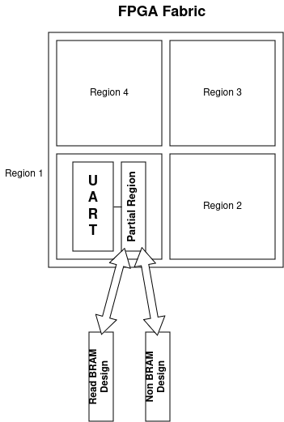

# Documentation on FPGA BRAMs for PUFs

## General

- BRAMs can have an initial value different from 0 after being switched on.  
- Initial values can potentially used to implement a PUF, a BRAM PUF.  
- This Readme sums up what has been done/found out/tested about possible BRAM PUFs on Xilinx FPGAs.
- The procedure used for tests includes manipulation of bs and is documented here aswell.
- The procedure + measurements will often be referred as "BRAM experiment" in this document
- Instructions came originally from [Paper by Wild & Güneysu 2014](https://gitlab.bitaggregat.de/hwt/hardware-security-module/hsm.pages.bitaggregat.de/uploads/d757e7e215824307a9c7764a4860b0d7/wild2014.pdf)

## BRAM

### XC7 FPGAs

- 36K BRAM Blocks
- 32K Data Bits and 4K Parity Bits
- Parity Bits can be used as extra Data Bits
- 2 x 18K Slices in BRAM Block
- BRAM Blocks in same column can be cascaded
- 10 BRAM Blocks in one column
- Multiple primitives
- Prioritize 36K primitive

### XCUS+ (Zynq) FPGAs

- Same size as XC7
- More extra features and primitives
- Sleep feature that allows to save BRAM content while "sleeping"

## Bitstream

### Why is Bitstream Manipulation needed?

- Getting the BRAM experiment involves bs manipulation
- Explaining in detail what the bitstream is composed of, goes beyond the scope of this document
- In nutshell:
  - Bitstream is composed of "Configuration Packages"
  - Configuration Package := Write/Read + Target Register + Payload
- There exists a specific set of Configuration Packages that write values to the BRAM, which overwrites the initial that are needed for a PUF
- Removing/dropping these packages from the bs is essential
- Partial Bitstreams are needed
  - The device writes 0 as a default value to the BRAM on startup
    - Using the process described above with full bitstreams would therefore not work
    - This was verified once in this project
  - Partial bitstreams can be loaded without fully restarting the device

### Bitstream Handler

- ```initialize_bram/bitstream_handling``` contains codebase that allows to unpack and handle Configuration Packages
- This codebase can be used like a python library
- It is currently used by scripts in ```initiliaze_bram/```
- Only a fraction of this python library is currently used
- Unused but available features are:
  - bs handling on configuration bits level
  - bs handling on [FASMs](https://github.com/chipsalliance/fasm) level
- More information about this library [here](/initialize_bram/bitstream_handling/README.md)

## Approach

### XC7 BRAMs

|Name|Use case|
|-|-|
|```initialize_bram.py```|Takes previously prepared bram bitstreams, modifies and flashes the latter such that bram is depowered, then repowered for reading|
|```read_bram_ftdi.py```|Reads out bram via ftdi uart. Uses a custom protocol to identify beginning of readout and parity bram bits (which are just glorified additional bram bits)|

**NOTES**:

- ```initialize_bram.py``` uses a "custom bitstream editor" (see bitstream_handling/README.md).
- using the custom editor with a python debugger is ideal for inspecting details about the bitstream
- TODO helper script ```analyze_bitstream.py``` to automatize use cases of the editor code base

### Terms

|Term|Definition|
|-|-|
|**Target partial region**| A statically defined partial region used for designs.|
|**"Read BRAM" full Design**| A Hardware design that contains a UART and a BRAM Block that is readout. Fills the BRAM with either 0 or f. The BRAM Block is routed in the target partial region.|
|**BRAMless partial Design**| A partial design that returns either 0 or f via LUTs. It is located in the target partial region and can replace the BRAM Block.|
|**"Read BRAM" partial Design**| Partial version of "Read BRAM" full design. Contains only the BRAM part, not the UART.|
|**"Read BRAM" full bitstream**| Bistream of "Read BRAM" full Design|
|**BRAMless partial bitstream**| Bitstream of BRAMless partial Design|
|**"Read BRAM" partial bitstream**| Bitstream of "Read BRAM" partial Design|
|**Manipulated bitstream**| A modified version of "Read BRAM" partial bitstream. Removes Configuration Packages that write values to the BRAM, leaving the BRAM with its initial "random" values.|

### General Approach



1. Create "Read BRAM" full Design, BRAMless partial Design and "Read BRAM" partial Design in a Vivado project and synthethize bitstreams
2. Flash "Read BRAM" full bitstream
3. Flash BRAMless partial bitstream (this will disconnect BRAM from the power grid)
4. Optional: Wait for specific amount of time or/and expose FPGA to high temperatures
5. Modify "Read BRAM" partial bitstream in order to create a manipulated bitstream
6. Flash manipulated bitstream
7. Readout BRAM via UART

### Practical Approach

Scripts have been written in order to ease and partially automatize the steps mentioned in [General Approach](###General Approach).  
Sadly tools do not always support all FPGA devices, which is why the instructions and tools may differ depending on the used device.  

#### te0802 and zcu102 (US+ ZynqMP Boards)

- Step 1 is contained in [a vivado project](/vivado_project/README.md) of this repository
- Step 2 - 7 can be done automatically by using ```run_pblock_analysis.sh```

##### run_pblock_analysis

- Prerequisite: Define Pblocks around target BRAMs (already done in the provided Vivado projects)
- Calling ```run_pblock_analysis.sh``` can be made easier by using a config file, like the provided ```config.sh``` in this repo
  - More config files may be generated via ```pblock_run_configs/config_files_generator.py```
- ```run_pblock_analysis.sh``` calls other smaller scripts for subtasks:
  - Flashing and generating bitstreams is done via Vivado (and tcl scripts)
  - Creating the manipulated bitstream is done via ```initialize_bram/create_partial_initialization_bitstream.py```
  - Reading from the Digilent UART adapter is done via ```reading/read_bram_ftdi.py```  
  - Note: All these scripts named above can be called with ```-h``` for usage information.
- Running multiple calls of ```run_pblock_analysis.sh``` may be done by calling ```run_device_analysis.sh``` with multiple pblock config files

## Measurements

See [README in Subdirectory](measurements/measurements_and_observations.md)

## Observations

See [README in Subdirectory](measurements/measurements_and_observations.md)

## Conclusion

- Using XC7 FPGA BRAMs for PUF is either hardly possible or will atleast require alot of extra work
- Neither temperature change nor increased wait time had an influence on the amount of flipped bits in XC7 FPGAs

## Future Work / TODOs

This section contains TODOs that have currently been deemed not irrelevant, but might become relevant again in the future:

### XC7 BRAM bitflips and multiple flashing procedures

- XC7 BRAMs on basys3 had very few bitflips
- More bits flip under the condition that the manipulated bitstream is flashed multiple times to the FPGA
- May be usable if a sufficient number of flashing procedures is done
- Extensive statistic would be needed in order to verify the following questions:
  - How unique are flipped bits obtained through this procedure?
  - How reliable is this procedure?
  - How many flashing procedures (and time) are needed in order to make it reliable?
  - Why does this work?
  - Can these multiple flashing procedures be replaced by one single flashing procedure (e.g. one bitstream that sends the same instruction 100x)

### Measuring how Aging influences the BRAM

- BRAM flips may behave differently after being in use for a long time
- BRAM flips may behave differently after being written to many times
- Setup automatic process where BRAM is measured regulary over a year (e.g. once every day for a year)
- This setup could be done over a CI/CD Pipeline or directly on the PS of a Zynq device

## Glossary

|Term/Macro|Definition|
|-|-|
|**XC7**| Xilinx 7-Series|
|**XCUS**| Xilinx UltraScale|
|**XCUS+**| Xilinx UltraScale+|
|**bs/BS**| Bitstream|
|**Target partial region**| A statically defined partial region used for designs.|
|**"Read BRAM" full Design**| A Hardware design that contains a UART and a BRAM Block that is readout. Fills the BRAM with either 0 or f. The BRAM Block is routed in the target partial region.|
|**BRAMless partial Design**| A partial design that returns either 0 or f via LUTs. It is located in the target partial region and can replace the BRAM Block.|
|**"Read BRAM" partial Design**| Partial version of "Read BRAM" full design. Contains only the BRAM part, not the UART.|
|**"Read BRAM" full bitstream**| Bistream of "Read BRAM" full Design|
|**BRAMless partial bitstream**| Bitstream of BRAMless partial Design|
|**"Read BRAM" partial bitstream**| Bitstream of "Read BRAM" partial Design|
|**Manipulated bitstream**| A modified version of "Read BRAM" partial bitstream. Removes Configuration Packages that write values to the BRAM, leaving the BRAM with its initial "random" values.|
