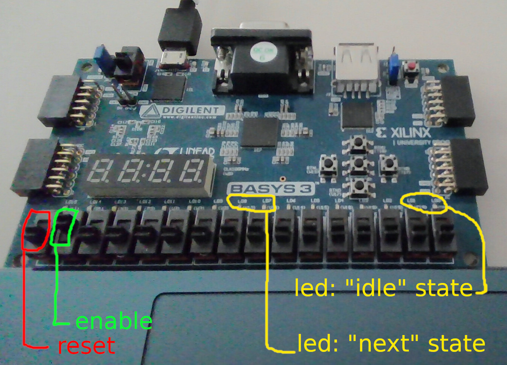

# Reading BRAM via ftdi

This directory contains a simple python script that readouts bram from an fpga using JTAG via an ftdi chip and UART.  
It also uses a "custom protocol" that is in accordance with [TODO insert link]().  

## Usage

Example call:  

```bash
python read_bram_ftdi.py -d 210183A89AC3
```

Help output (used by calling with ```-h```):  

```bash
usage: read_bram_ftdi.py [-h] [-d DEVICE] [-s]

Script that reads bram data via UART and does some evalutation on it.

options:
  -h, --help            show this help message and exit
  -d DEVICE, --device DEVICE
                        Serial number of device.
  -s, --show_device     Show currently connected ftdi devices. NOTE: Devices occupied by Vivados Hardware Manager may not
                        be available.
```


## Dependencies

- [pyftdi](https://eblot.github.io/pyftdi/)

## Switches and LEDS



- Reads will only follow if the **enable** switch is switched on.  
- When doing multiple measurements, the **reset** switch should be toggled once between every measurement.  
- It is also recommended to only switch on the **enable** switch once the reading script has already started.
